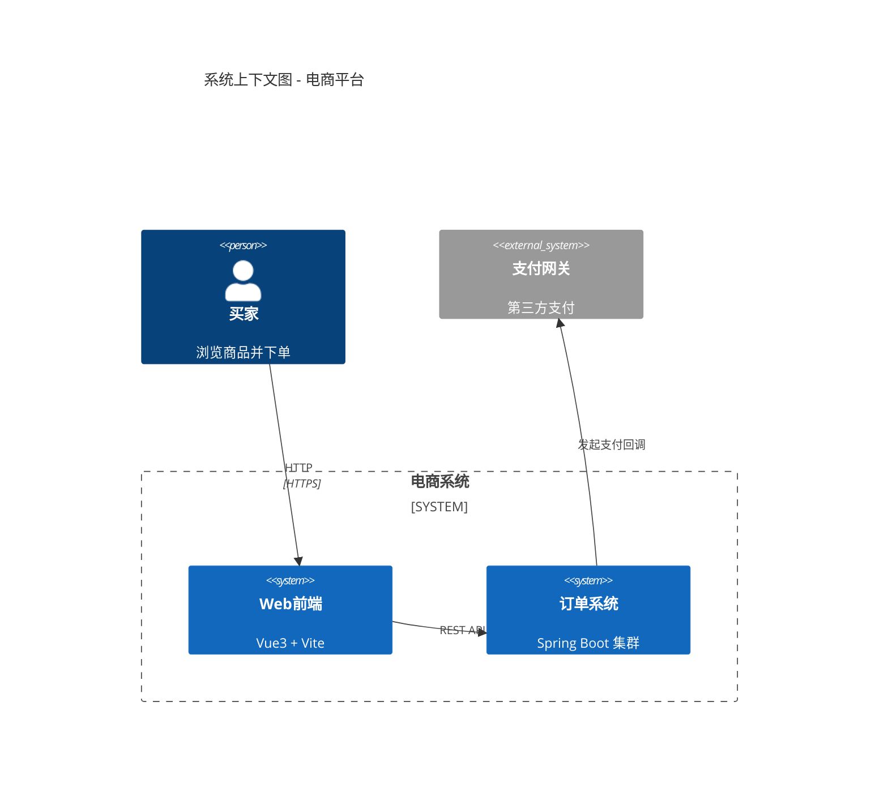

## C4 模型概述

C4 模型由 Simon Brown 提出，通过 4 个抽象层次描述软件架构：

```
Level 1: System Context    (系统上下文)
Level 2: Container         (容器/服务)
Level 3: Component         (组件)
Level 4: Code              (代码/类)
```

## 四个层次详解

### Level 1: 系统上下文图

展示软件系统与外部用户、系统的关系。

```
[用户] --(下单)--> [订单系统] --(支付请求)--> [支付网关]
                      |
                      --> [发送邮件] --> [邮件服务]
```

**谁需要看**：非技术人员、项目经理、新入职开发
**关键信息**：系统边界、外部依赖、用户角色
**工具推荐**：Structurizr DSL（最推荐）、Mermaid、Draw.io

### Level 2: 容器图

"容器"指独立的可部署单元：微服务、Web 应用、数据库、消息队列。

```
[Web App: Vue3] --(API)--> [API Gateway: Spring Cloud Gateway]
                              |
          +-------------------+-------------------+
          |                   |                   |
   [Order Service]    [Payment Service]    [Notification Service]
          |                   |                   |
   [PostgreSQL]         [Redis]             [RabbitMQ]
```

**谁需要看**：开发团队、DevOps、架构师
**关键信息**：技术选型、通信协议（HTTP/gRPC/消息）、数据存储

### Level 3: 组件图

展示单个容器内部的逻辑组件。

```
[Order Service]
    ├── OrderController (REST API)
    ├── OrderService (业务逻辑)
    ├── OrderRepository (数据访问)
    ├── OrderEventPublisher (事件发布)
    └── PaymentClient (Feign 客户端)
```

**谁需要看**：该服务的开发人员
**关键信息**：组件职责、接口依赖、职责边界
**注意**：不要画成类图，保持组件粒度

### Level 4: 代码图

即实际的代码实现——类、接口、方法。这部分通常不需要额外画图，代码本身就是。

## Structurizr DSL 实践

最推荐的 C4 工具——DSL → 自动生成图表，且可 CI/CD 集成。

```c4
// workspace.dsl
workspace "电商平台" "电商微服务架构" {

    model {
        // 定义用户
        user = person "买家" "浏览商品并下单"
        
        // 定义软件系统
        webApp = softwareSystem "Web前端" "Vue3 + Vite" {
            tags "frontend"
        }
        
        orderSystem = softwareSystem "订单系统" "Spring Boot 微服务集群" {
            tags "backend"
        }
        
        paymentGateway = softwareSystem "支付网关" "第三方支付" {
            tags "external"
        }
        
        // 定义关系
        user -> webApp "浏览/下单"
        webApp -> orderSystem "HTTP REST API"
        orderSystem -> paymentGateway "发起支付"
    }
    
    views {
        // Level 1: 系统上下文
        systemContext orderSystem {
            include *
            autoLayout
        }
        
        // Level 2: 容器图
        container orderSystem {
            include *
            autoLayout
        }
        
        styles {
            element "frontend" {
                background "#1168bd"
                color "#ffffff"
            }
            element "backend" {
                background "#4caf50"
                color "#ffffff"
            }
            element "external" {
                background "#999999"
                color "#ffffff"
            }
        }
    }
}
```

```bash
# 生成架构图（需要 Docker）
docker run --rm -v $(pwd):/workspace structurizr/cli \
  push -w /workspace/workspace.dsl \
  -id YOUR_WORKSPACE_ID -key YOUR_API_KEY -secret YOUR_API_SECRET

# 或导出为 PlantUML
docker run --rm -v $(pwd):/workspace structurizr/cli \
  export -w /workspace/workspace.dsl -f plantuml -o /workspace/diagrams/
```

## Mermaid 替代方案（不需要额外工具）



```bash
# 在 mkdocs / docusaurus 中集成
npm install mermaid
# Mermaid 原生支持 C4 DSL（v10.9+）
```

## 与 ADR 结合使用

C4 图与架构决策记录（ADR）配合效果最佳：

```
docs/
├── architecture/
│   ├── c4-context.md      # Level 1 上下文图
│   ├── c4-container.md    # Level 2 容器图
│   └── c4-component/      # Level 3 组件图（每个容器一个）
│       ├── order-service.md
│       └── payment-service.md
├── adr/
│   ├── 001-use-rabbitmq.md
│   ├── 002-quorum-queues.md
│   └── 003-cqrs-split.md
└── README.md
```

## C4 模型最佳实践

### 1. 只画有必要的图

- 每个 Level 2 容器图对应一个 ADR
- Level 3 只在核心复杂服务中画
- Level 4 不额外画（代码即文档）

### 2. 保持图简洁

```
✅ 好的: 每个图 4-8 个元素
❌ 差的: 一个图 20+ 个元素（等于没画）
```

### 3. 用标签管理视角

```c4
person "运维" "系统管理员" {
    tags "operator"
}

person "开发" "后端开发" {
    tags "developer"
}

// 不同角色看到不同视角
views {
    filter tag "operator" {
        include *
        exclude element.tag "developer"
    }
}
```

### 4. CI/CD 自动生成

```yaml
# .github/workflows/architecture.yml
name: Generate Architecture Docs
on:
  push:
    paths: ['docs/**/*.dsl']

jobs:
  structurizr:
    runs-on: ubuntu-latest
    steps:
      - uses: actions/checkout@v4
      - name: Generate diagrams
        run: |
          docker run --rm -v $(pwd):/workspace structurizr/cli \
            export -w docs/architecture.dsl -f plantuml -o docs/diagrams/
        env:
          STRUCTURIZR_API_KEY: ${{ secrets.STRUCTURIZR_API_KEY }}
```

## 注意事项

- **C4 不是 UML 替代品**：它是沟通工具，不是建模语言
- **不要过度设计**：中小项目只用 Level 1+2 就足够
- **保持一致**：团队统一定义"容器"和"组件"的粒度
- **及时更新**：架构图应在代码变更时同步更新（通过 CI 强制）
- **DSL 优先**：用 Structurizr DSL 而非手工绘制，方便版本控制和协作
- **C4 对微服务特别友好**：每个微服务天然对应一个容器
- **Mermaid C4 支持有限**：复杂图建议用 Structurizr 或 PlantUML
