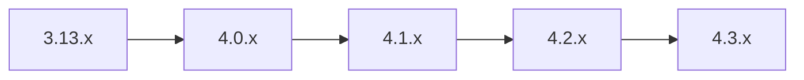

## 概述

RabbitMQ 4.3.0（2026-04-23 发布）是一个**重大架构升级版本**，移除了 Mnesia、CQv1 等遗留组件，全面转向 Khepri + Quorum Queues 的新架构。RabbitMQ 4.3.1（2026-05-20）为维护版本，修复了多个关键 Bug。

⚠️ **4.3.x 仅支持从 4.2.x 升级**，低于 4.2.x 的版本必须走多步升级路径。

## 一、Breaking Changes

### 1. Mnesia 彻底移除，Khepri 成为唯一元数据存储

4.3.0 完全移除了 Mnesia 存储引擎，Khepri（基于 Raft）成为唯一元数据存储方案。

**影响**：
- 集群可用性需要**多数派节点在线**
- 分区恢复逻辑统一（所有状态组件均使用 Raft 恢复语义）
- `cluster_partition_handling` 配置项不再生效（无实际影响）

```ini
# ❌ 以下配置在 4.3.x 中无任何效果，建议移除
# cluster_partition_handling = pause_minority
# cluster_partition_handling.pause_if_all_down.recover = ignore
```

### 2. Classic Queue v1 (CQv1) 存储移除

4.3.0 彻底移除了 CQv1 存储实现（CQv2 从 4.2.0 开始成为默认）。

**影响**：
- 以下队列参数会导致声明失败：
  - `x-queue-mode` 设置为任意值
  - `x-queue-version` 设置为 `1`
- 已在 4.2.x 升级到 CQv2 的现有队列不受影响

```java
// ❌ 以下声明在 4.3.x 会失败
Map<String, Object> args = new HashMap<>();
args.put("x-queue-version", 1);
channel.queueDeclare("old-queue", true, false, false, args);

// ✅ 正确方式（CQv2 已是默认）
channel.queueDeclare("cq2-queue", true, false, false, null);
```

### 3. 非持久化非排他队列默认禁用

4.3.0 默认禁止声明 non-durable + non-exclusive 的队列（即临时队列必须使用 `exclusive=true`）。

```ini
# 如需临时允许（仅作为迁移过渡），所有节点必须配置：
deprecated_features.permit.transient_nonexcl_queues = true
```

### 4. Consumer Timeout 不再对 Classic Queue 和 Stream 生效

Consumer timeout 的开闭评估逻辑移交给队列自身。Classic Queue 和 Stream 不再评估 consumer timeout。

### 5. 多个废弃特性默认关闭

| 废弃特性 | `deprecated_features.permit` Key | 说明 |
|---------|----------------------------------|------|
| AMQP 1.0 地址 V1 | `amqp_address_v1` | 推荐使用 V2 地址格式 |
| Global QoS | `global_qos` | 被 per-consument QoS 取代 |
| Queue Master Locator | `queue_master_locator` | CQv2 已内置优化 |
| AMQP Filter Set Bug | `amqp_filter_set_bug` | 修复旧版过滤行为 |

## 二、新特性

### 1. Quorum Queue 严格优先级

支持基于优先级的消息队列，保证高优先级消息优先消费。

```java
Map<String, Object> args = new HashMap<>();
args.put("x-queue-type", "quorum");
args.put("x-max-priority", 10);  // 启用优先级，范围 0-255
channel.queueDeclare("priority-queue", true, false, false, args);

// 发布消息时指定优先级
AMQP.BasicProperties props = new AMQP.BasicProperties.Builder()
    .priority(8)
    .build();
channel.basicPublish("", "priority-queue", props, msg.getBytes());
```

### 2. Quorum Queue 延迟重试

内置递增退避机制，适用于消息消费失败自动重试场景。

```java
// 通过 Policy 配置延迟重试
// rabbitmqctl set_policy delayed-retry "^retry-queue" '{
//   "delayed-retry-enabled": true,
//   "delayed-retry-initial-delay": 1000,
//   "delayed-retry-max-delay": 60000,
//   "delayed-retry-multiplier": 2
// }' --apply-to queues

// 或通过声明队列参数
Map<String, Object> args = new HashMap<>();
args.put("x-queue-type", "quorum");
args.put("x-delayed-retry-enabled", true);
args.put("x-delayed-retry-initial-delay", 1_000);  // 1s
args.put("x-delayed-retry-max-delay", 60_000);     // 60s
args.put("x-delayed-retry-multiplier", 2);          // 指数退避
channel.queueDeclare("payment-retry-queue", true, false, false, args);
```

### 3. Quorum Queue Consumer Timeout

自定义未确认消息的超时阈值，支持 AMQP 1.0 和 MQTT 协议。

```bash
# Policy 配置
rabbitmqctl set_policy qq-consumer-timeout "^timeout-queue" '{
  "consumer-timeout": 300000
}' --apply-to queues
```

### 4. 恢复快照与快照节流

减少 Quorum Queue 节点崩溃后的恢复时间。

```bash
# 配置快照节流
rabbitmqctl set_policy snapshot-throttle "^throttled-queue" '{
  "snapshot-throttle-enabled": true,
  "snapshot-throttle-max-chunk-size": 1000
}' --apply-to queues
```

## 三、升级路径



1. **逐步升级**：必须经过 `3.13.x → 4.0.x → 4.1.x → 4.2.x → 4.3.x`
2. **启用 Feature Flags**：升级前确保启用所有必需的 feature flags：
   ```bash
   rabbitmqctl list_feature_flags
   ```
3. **检查 CQv1 队列**：升级前确认所有 Classic Queue 已转为 CQv2
   ```bash
   rabbitmqctl list_queues name type storage_version
   ```
4. **移除废弃配置**：清理 `cluster_partition_handling` 等遗留配置
5. **滚动升级**：执行滚动重启，确认每个节点加入集群后再操作下一个

## 四、4.3.1 Bug 修复要点

| Issue | 描述 | 影响 |
|-------|------|------|
| #16271 | 空 binding key 导致消息路由到错误队列 | 启用 `topic_binding_projection_v5` feature flag 修复 |
| #16422 | 虚拟主机在元数据超时场景被误认为已删除 | 修复超时处理逻辑 |
| #16272 | 被动声明的权限检查放宽 | 有任意权限即可声明 |
| #16142 | CQ 共享消息存储 GC 在高负载下落后 | GC 效率改进 |
| #16280 | Quorum Queue 支持负优先级值 | 负值不再报错 |
| #16382 | Raft WAL max entries 默认值恢复为 500K | 4.3.0 中未正确恢复默认值 |

## 注意事项

| 要点 | 说明 |
|------|------|
| **升级不可逆** | 升级到 4.3.x 后无法降级到 4.2.x（Khepri 数据格式不兼容） |
| **Erlang 版本** | 4.3.x 需要 Erlang 26+，节点将在低版本上启动失败 |
| **Mnesia 插件影响** | 使用 Mnesia 的社区插件在 4.3.x 上无法工作 |
| **Feature Flag 顺序** | 启用 `rabbitmq_4.0.0` 后至少做一个滚动更新，再升级到 4.3.x |
| **非持久队列迁移** | 临时队列应改用 `exclusive=true` 或设置队列 TTL |
