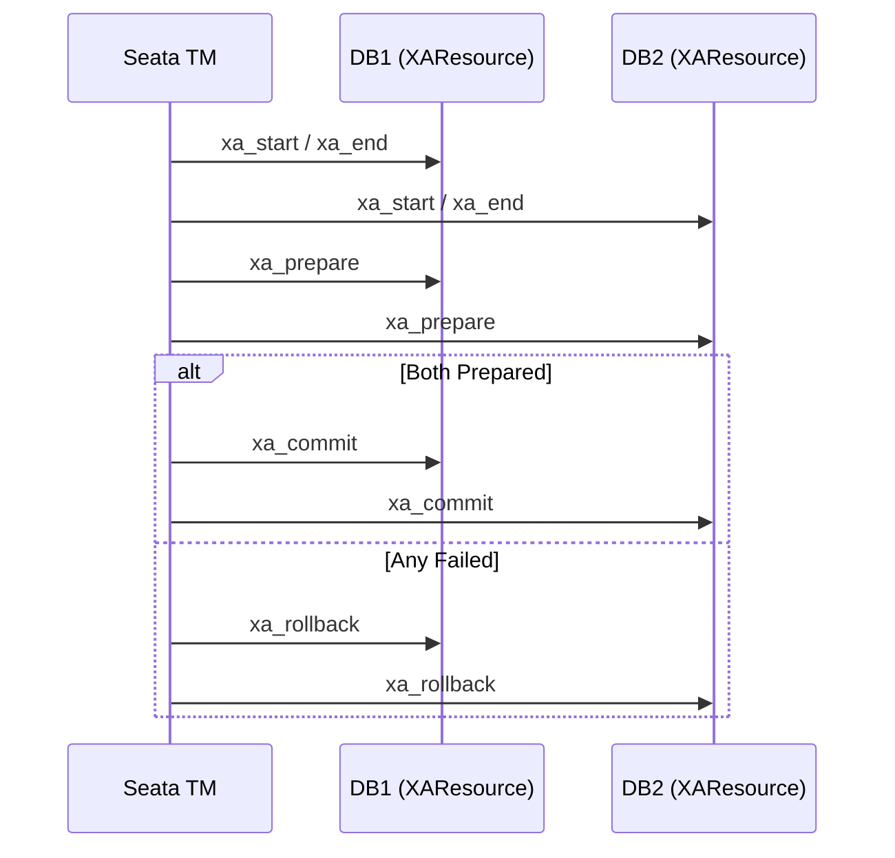

## 概述

Seata XA 模式基于**数据库层面的 XA 协议**（JTA/JTS），通过 `javax.transaction.xa.XAResource` 实现分布式事务。Seata 作为 TM（事务管理器），协调多个 RM（资源管理器）的 Prepare → Commit/Rollback。

相比 AT 模式自动生成逆向 SQL，XA 模式直接利用数据库原生事务协议，**无需修改业务 SQL**，但要求数据库和驱动支持 XA。

> Seata 2.6.0 扩展了 XA 支持：新增达梦（DM）数据库、神通数据库（Shentong）支持，以及 Oracle 批量插入 XA 支持。

---

## 核心原理



---

## 快速集成

### 1. 依赖

```xml
<dependency>
    <groupId>org.apache.seata</groupId>
    <artifactId>seata-rm-datasource</artifactId>
    <version>${seata.version}</version>
</dependency>
```

### 2. 数据源配置

XA 模式必须使用 `DataSourceProxyXA` 代理：

```java
@Configuration
public class DataSourceConfig {

    @Bean
    @ConfigurationProperties(prefix = "spring.datasource.ds1")
    public DataSource dataSource1() {
        return DataSourceBuilder.create().build();
    }

    @Bean("ds1Proxy")
    public DataSource dataSource1XA() {
        // XA 数据源代理
        return new DataSourceProxyXA(dataSource1());
    }

    @Bean
    @ConfigurationProperties(prefix = "spring.datasource.ds2")
    public DataSource dataSource2() {
        return DataSourceBuilder.create().build();
    }

    @Bean("ds2Proxy")
    public DataSource dataSource2XA() {
        return new DataSourceProxyXA(dataSource2());
    }
}
```

### 3. application.yml

```yaml
seata:
  enabled: true
  application-id: xa-order-service
  tx-service-group: xa-tx-group
  service:
    vgroup-mapping:
      xa-tx-group: default
  data-source-proxy-mode: XA  # 关键！指定为 XA 模式

spring:
  datasource:
    ds1:
      jdbc-url: jdbc:mysql://localhost:3306/db1
      username: root
      password: root
      driver-class-name: com.mysql.cj.jdbc.Driver
    ds2:
      jdbc-url: jdbc:mysql://localhost:3306/db2
      username: root
      password: root
      driver-class-name: com.mysql.cj.jdbc.Driver
```

### 4. 使用

与 AT 模式完全相同的注解：

```java
@Service
public class OrderService {

    @GlobalTransactional(rollbackFor = Exception.class)
    public void createOrder(OrderDTO order) {
        // 操作 db1
        orderMapper.insert(order);        // ds1Proxy
        // 操作 db2
        accountMapper.deduct(order);      // ds2Proxy
    }
}
```

---

## 支持的数据源

| 数据库 | Seata 支持版本 | 注意事项 |
|---|---|---|
| MySQL | 全版本 | 需 `mysql-connector-j` 8.x+ |
| PostgreSQL | 2.6.0+ 增强 | 支持带时区时间戳主键（[#7908](https://github.com/apache/incubator-seata/pull/7908)） |
| Oracle | 2.6.0+ | 支持批量插入（[#7675](https://github.com/apache/incubator-seata/pull/7675)） |
| MariaDB | 2.6.0+ | 支持 3.x 驱动（[#7807](https://github.com/apache/incubator-seata/pull/7807)） |
| DM（达梦） | 2.6.0+ | `XABranchXid` 修复内存泄漏（[#7683](https://github.com/apache/incubator-seata/pull/7683)） |
| 神通数据库 | 2.6.0+ | 保持同一连接执行 XA（[#7771](https://github.com/apache/incubator-seata/pull/7771)） |
| Kingbase | 2.6.0+ | 索引类型判断修复（[#7843](https://github.com/apache/incubator-seata/pull/7843)） |

---

## 配置优化

### 1. 事务超时

```yaml
seata:
  client:
    tm:
      default-global-transaction-timeout: 60000  # 全局事务超时 60s
  xa:
    connection-timeout: 30000        # XA 连接超时
    branch-timeout: 30000            # 分支事务超时
```

### 2. 连接池配置

XA 模式每个分支事务会独占一个数据库连接，连接池必须预留足够连接：

```yaml
spring:
  datasource:
    ds1:
      hikari:
        maximum-pool-size: 20        # 比 AT 模式需求更大
        minimum-idle: 5
        max-lifetime: 600000
        connection-timeout: 10000
```

**计算公式**：`最大连接数 ≥ 最大并发全局事务数 × 每个全局事务涉及的分支数 × 2`

### 3. 数据库 XA 超时

```sql
-- MySQL XA 事务超时
SET GLOBAL innodb_lock_wait_timeout = 50;

-- PostgreSQL XA
-- 调整 max_prepared_transactions
max_prepared_transactions = 100     -- 默认 0，务必修改
```

---

## 关键注意事项（坑点）

### 1. 连接池泄漏风险

XA 事务中，如果应用异常退出而未执行 `xa_commit/xa_rollback`，数据库中会残留**悬挂 XA 事务**（In-Doubt Transaction）：

```sql
-- MySQL：查看悬挂 XA 事务
XA RECOVER;

-- 手动清理
XA ROLLBACK 'hex-format-xid';
```

### 2. PostgreSQL 需配置 max_prepared_transactions

PostgreSQL 默认 `max_prepared_transactions = 0`，XA 模式会直接失败：

```ini
# postgresql.conf
max_prepared_transactions = 100     # 建议 ≥ 并发事务数
```

### 3. XA 性能瓶颈

- **两阶段提交延迟**：每次 Prepare + Commit 增加约 2-5ms
- **连接独占**：Prepare 后连接不能释放，降低连接池利用率
- **不适用于长事务**：超过 30s 的事务会严重占用连接资源

### 4. 非 XA 兼容的 SQL

以下操作在 XA 事务中不兼容：
- `CREATE TEMPORARY TABLE`
- `ALTER TABLE` / DDL 语句（大部分数据库）
- MySQL 的 `AUTOCOMMIT=0` + 隐式提交语句

### 5. 驱动版本兼容

```xml
<!-- MySQL 推荐 -->
<dependency>
    <groupId>com.mysql</groupId>
    <artifactId>mysql-connector-j</artifactId>
    <version>8.4.0</version>   <!-- 8.0.x 可能有 XA BUG -->
</dependency>

<!-- PostgreSQL 推荐 -->
<dependency>
    <groupId>org.postgresql</groupId>
    <artifactId>postgresql</artifactId>
    <version>42.7.11</version>  <!-- Seata 2.6.0 推荐版本 -->
</dependency>
```

---

## 与 AT 模式对比

| 对比维度 | XA 模式 | AT 模式 |
|---|---|---|
| **原理** | 数据库 XA 协议两阶段提交 | 逆向 SQL 自动回滚 |
| **SQL 侵入** | 无（无需修改业务代码） | 无（自动生成回滚 SQL） |
| **隔离性** | ✅ 读已提交 + 全局锁 | ✅ 读已提交 + 全局锁 |
| **性能** | ⭐⭐⭐（Prepare 额外开销） | ⭐⭐⭐⭐（仅生成 SQL） |
| **数据库兼容** | ❌ 需数据库支持 XA | ✅ 任何 JDBC 数据库 |
| **回滚可靠性** | ✅ 数据库保证原子性 | ⭐⭐⭐ SQL 生成可能出错 |
| **连接占用** | ❌ 两阶段独占连接 | ✅ Prepare 后释放连接 |
| **长事务** | ❌ 连接会耗尽 | ⭐⭐⭐ 可承受较长事务 |
| **缓存表** | ❌ 不需要 | ✅ 需建 undo_log 表 |

---

## 选型建议

| 适合用 XA | 适合用 AT |
|---|---|
| 强一致性要求（金融级） | 大多数业务系统 |
| 数据库原生支持 XA 且稳定 | 数据库不原生支持 XA |
| 短事务（< 5s） | 中长事务 |
| 不想维护 undo_log 表 | 需要更好的连接利用率 |
| 已有 JTA 经验 | 追求吞吐量 |

---

## 参考链接

- [Seata XA 官方文档](https://seata.apache.org/docs/user/xa/)
- [Seata 2.6.0 Release Notes](https://github.com/apache/incubator-seata/releases/tag/v2.6.0)
- [MySQL XA 事务文档](https://dev.mysql.com/doc/refman/8.4/en/xa.html)
- [PostgreSQL PREPARE TRANSACTION](https://www.postgresql.org/docs/current/sql-prepare-transaction.html)
